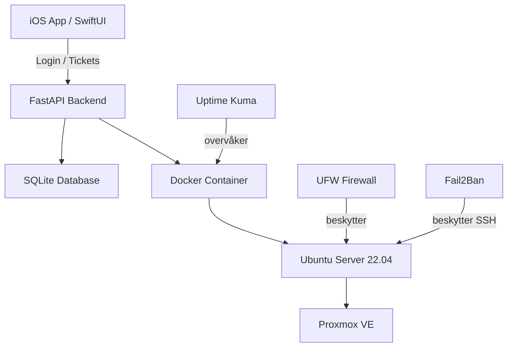

# Infrastrukturdiagram – HelpdeskGuard

## Komponenter

| Komponent | Rolle |
|--------|--------|
| iOS App | Brukergrensesnitt |
| FastAPI | Backend API |
| SQLite | Databaselagring |
| Docker | Kjøremiljø |
| Ubuntu | Server |
| Proxmox | Virtualisering |
| Uptime Kuma | Overvåking |
| UFW | Brannmur |
| Fail2Ban | Beskyttelse mot angrep |
