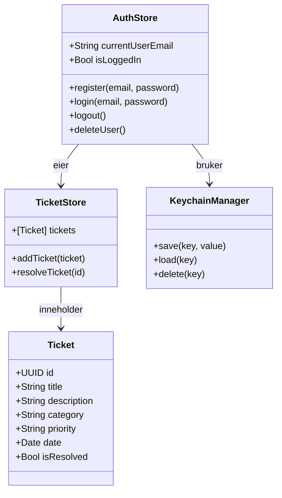

# UML Klassediagram – HelpdeskGuard

```mermaid
classDiagram
    class AuthStore {
        +String currentUserEmail
        +Bool isLoggedIn
        +register(email, password)
        +login(email, password)
        +logout()
        +deleteUser()
    }

    class TicketStore {
        +[Ticket] tickets
        +addTicket(ticket)
        +resolveTicket(id)
    }

    class Ticket {
        +UUID id
        +String title
        +String description
        +String category
        +String priority
        +Date date
        +Bool isResolved
    }

    class KeychainManager {
        +save(key, value)
        +load(key)
        +delete(key)
    }

    AuthStore --> KeychainManager : bruker
    TicketStore --> Ticket : inneholder
    AuthStore --> TicketStore : eier
```